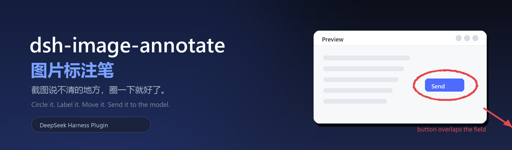
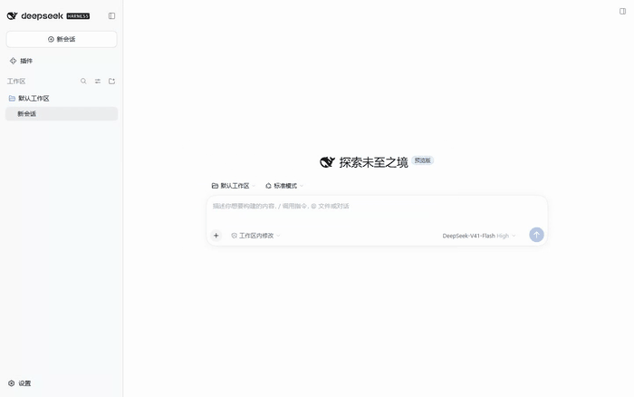
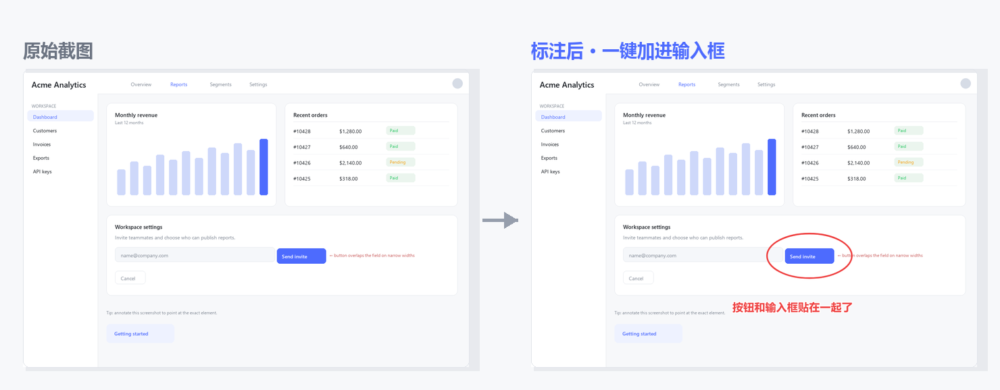
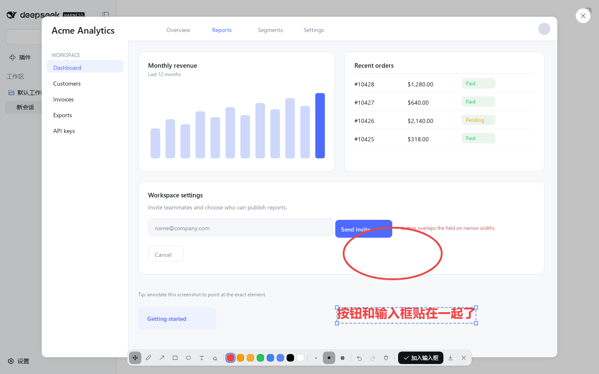

<div align="center">
  

  <h3>Circle the problem right on the preview, keep nudging every mark,<br>and drop the annotated image straight into the composer.</h3>

  [](https://github.com/topics/dsh-plugin)
  [](#-compatibility)
  [](./package.json)
  [](./test)
  [](./LICENSE)
  [](https://github.com/zhishengplus/dsh-image-annotate)

  <a href="README.md">简体中文</a> · <b>English</b>
</div>

<p align="center">
  
</p>

<p align="center"><sub>Open an image → circle the problem → type a note → drag both into place → Add to composer → send</sub></p>

---

<h3 align="center">🎯 The problem it solves</h3>

> "Move that button 8px to the left." — Which button?
>
> "This overlaps on narrow screens." — So you take another screenshot and draw an arrow on it.
>
> You hand a screenshot to an AI and say "this is broken here" — and it starts guessing where "here" is.

The wording was never the issue. **"Here" is something you have to point at.**
This plugin turns that into two seconds: **open the image → circle it → type → Add to composer → send.**

<p align="center">
  
</p>

<p align="center"><sub>Left: the original. Right: <b>the exact PNG the model receives</b> after “Add to composer” — original resolution, marks included.</sub></p>

<h3 align="center">✨ Highlights</h3>

| | |
|---|---|
| 🖊 **Seven tools** | Move · Pen · Arrow · Box · Circle · Text · Eraser. Box and Circle form from the whole traced path, so a freehand loop works too |
| 🖐 **Editable after drawing** | Every mark is a live object: select, drag, scale by a corner handle, double-click to re-edit text, delete, nudge with arrow keys — all undoable |
| 🔤 **Text is an object** | Double-click to rewrite it (no duplicate layer); the Text tool can drag a placed label directly |
| 🎨 **Native look** | Toolbar, buttons, toasts and selection chrome are built from DSH design tokens; light and dark themes just work |
| 📨 **One click into the composer** | Flattened at original resolution and handed to the composer's own paste channel; falls back to drop → clipboard → download |
| 🪶 **Zero deps, no build** | No `@deepseek-ai/*` import, no `dsh-loader`, no bundler output — the npm tarball is 4 files |
| 🖼 **Works on every preview** | Screenshots in the conversation, draft attachments, tool-result images — same preview, same pen |

<h3 align="center">🚀 Quick start</h3>

1. **Click any image** in a session;
2. a round **Annotate** button appears in the preview's bottom-right (same shape as the native close button) — click it;
3. use **Circle / Box / Arrow** to mark the spot, or **Text** to write a note on the image;
4. not happy with the position? **Just drag it** (next section);
5. hit **Add to composer** — the image is attached to your input box, the preview closes, and you type your message as usual.

| Shortcut | Action |
| :-- | :-- |
| `V` | Select / move |
| `1` – `7` | Move · Pen · Arrow · Box · Circle · Text · Eraser |
| `E` | Eraser (removes the mark you click) |
| `Ctrl/⌘ + Z` · `Ctrl/⌘ + Shift + Z` | Undo · redo |
| `Delete` | Remove the selection |
| Arrow keys (`Shift` to accelerate) | Nudge 1px / 10px |
| Text tool | Click on the image → type → `Enter` (`Esc` cancels) |

<h3 align="center">🖐 Editing after the fact is the point</h3>

A paint tool burns pixels; this doesn't — **every mark stays editable**:

| Goal | How |
| :-- | :-- |
| **Select** | Switch to Move (`V`) and click any mark — the one you just drew is selected automatically |
| **Move** | Drag it; arrow keys nudge 1px, `Shift + arrows` 10px |
| **Scale** | Drag a corner handle of the selection box (text scales its font size too) |
| **Re-edit text** | **Double-click** any label and rewrite it — same mark, no duplicate |
| **Delete** | `Delete`, or the trash button (it becomes "delete selection" whenever something is selected) |
| **Regret** | Every step above is one undo away — `Ctrl+Z` all the way back |

<p align="center">
  
</p>

<p align="center"><sub>Both the circle and the label have been moved — the dashed box and handles use DSH's native accent colour</sub></p>

<h3 align="center">🎨 It looks like DSH grew it itself</h3>

The whole toolbar is assembled from DSH design tokens — no second visual language:

| Part | Native tokens |
| :-- | :-- |
| Toolbar surface | `--dsw-menu-surface-fill` + `--dsw-menu-backdrop-filter` + `--dsw-elevation-panel` + `--dsw-radius-lg` |
| Tool buttons | `--dsw-alias-button-tool-bar-fill` / `-hover` · `--dsw-alias-interactive-bg-hover` |
| Primary action | `--dsw-alias-button-primary-fill` · `--dsw-alias-label-primary-foreground` |
| Entry button | The **same 36px round button** as the preview's close control (`--dsw-specific-input-major` + 0.5px hairline) |
| Toasts | `--dsw-alias-toast-bg` / `-label` + `--dsw-shadow-lv3` (top-centred, like the native toast) |
| Selection | `--dsw-alias-state-business-primary` |
| Palette | Native static colours: red · amber · yellow · green · blue · brand `deepseek-450` · black · white |

---

<h3 align="center">🛠 For developers</h3>

<details>
<summary><b>Three “nots” that keep it working across DSH upgrades</b></summary>

| | What it does | Why it helps |
| :-- | :-- | :-- |
| **Doesn't touch the host** | No slot registration, no React tree surgery — it overlays its own canvas + toolbar on the preview DOM and removes both when the preview closes | No state fights with the official UI, immune to re-renders |
| **Doesn't depend on internals** | No `@deepseek-ai/*` import, no injected dsh service, no `dsh-loader` needed | Internal renames or API changes can't break it |
| **Doesn't need a build** | The browser half is a hand-written `window.__ModuleLoader__.load` factory (`lib/client.js`) — no tsdown/rollup output | Edit and reload (client-modules HMR keys on mtime); the tarball is 4 files |

</details>

<details>
<summary><b>How it works</b></summary>

- **Preview detection** — one stable trait: a `div[role="dialog"][aria-modal="true"]` directly under `body` whose **direct child is an ``** (that's `dsh-client-ui-primitives`' `ImageLightbox`). A throttled `MutationObserver` mounts on appear and destroys on removal.
- **Coordinate system** — all marks are stored in **original-image pixels**. The overlay scales them to the displayed size; the export draws them at natural size. A 1909×1231 screenshot shown at 1427×920 therefore exports as a 1909×1231 PNG with every mark exactly where you put it.
- **Edit model** — strokes are plain objects (`{tool, color, points[], x, y, fontSize, textWidth…}`). Select / move / scale / re-edit evaluate the object and repaint the frame; a drag recomputes from the "snapshot at pointer-down + delta" each frame instead of accumulating, so nothing drifts.
- **Delivery** — image and marks are flattened into a PNG (`File`), then a **synthetic `paste` event carrying that file** is dispatched to the Lexical input (`[data-composer-input]`) — the same path a user-pasted screenshot takes. Fallbacks in order: document-level `drop` → clipboard (with a `Ctrl+V` hint) → PNG download.
- **Taint-proof export** — the original is re-fetched as a blob and decoded via `createImageBitmap` before compositing, avoiding `toBlob` SecurityErrors on cross-origin previews.

> One fun trap: a `position: fixed` overlay with `left: 50%` sizes itself against the space *right of* `left`, so the toolbar wrapped for no visible reason — `width: max-content` is the fix (the native Toast CSS documents the same trap).

</details>

<details>
<summary><b>How far it's verified</b></summary>

| Suite | Covers | Result |
| :-- | :-- | :-- |
| [`test/test_annotate.py`](test/test_annotate.py) | canvas alignment, stroke pixels, undo, circle forming, export size, paste delivery, auto-close | **17 / 17** |
| [`test/test_edit.py`](test/test_edit.py) | select, drag, corner-handle scaling, text drag + double-click edit, arrow-key nudge, delete and undo | **19 / 19** |
| [`test/e2e_dsh.py`](test/e2e_dsh.py) | a **real dsh instance** (isolated profile + own port): open preview → circle → drag → label → deliver → assert the attachment is the original 1909×1231 | **21 / 21** |

The first two run against the bundled fixture ([`test/lightbox-fixture.html`](test/lightbox-fixture.html), which mirrors the real preview DOM shape); the third needs a disposable instance — see the script header and [PUBLISHING.md](PUBLISHING.md). CI ([`.github/workflows/ci.yml`](.github/workflows/ci.yml)) runs the syntax check plus both fixture suites on every push.

</details>

<details>
<summary><b>Debug</b></summary>

```js
__dshImageAnnotate.annotators[0].state   // tool / strokes / selected / natural / rect …
localStorage.setItem('@dsh-plugin/dsh-image-annotate.debug', '1')   // verbose logs
```

</details>

<h3 align="center">📦 Install / uninstall</h3>

```sh
# from GitHub (works right now)
dsh plugin --profile <PROFILE> add github:zhishengplus/dsh-image-annotate

# from npm, once published
dsh plugin --profile <PROFILE> add @<scope>/dsh-image-annotate

# local development (link a checkout)
dsh plugin --profile <PROFILE> add link:/path/to/dsh-image-annotate
```

Then make sure it is listed in the profile's `package.json`:

```jsonc
"dsh": { "profile": { "bundles": [ /* …, */ "<the package name you installed>" ] } }
```

**One DSH restart is required the first time** (profile bundles are composed at boot). After that, edits to `lib/client.js` are picked up by client-modules HMR (keyed on mtime) with a page refresh.

Uninstall: remove the folder from the profile's `node_modules` and drop the line from `dsh.profile.bundles`.

<h3 align="center">🧭 Compatibility</h3>

| | |
| :-- | :-- |
| Verified against | dsh `0.2.0-rc.2` (the plugin only relies on the preview's DOM contract, so it should survive most upgrades) |
| Node | ≥ 20 (repository scripts only — the plugin itself runs in the browser) |
| Dependencies | **none**: no `@deepseek-ai/*`, no `dsh-loader`, no third-party runtime |

<h3 align="center">🗺 Roadmap</h3>

- [x] Circle / arrow / box / text / eraser, with select, drag, scale, re-edit and delete after drawing
- [x] Original-resolution export + one-click delivery with three fallbacks
- [x] Fully native-token appearance
- [ ] Highlighter / mosaic redaction
- [ ] Annotation for images opened from the right-hand file browser
- [ ] Auto-numbered "annotation list" sent alongside the image

<h3 align="center">📄 License</h3>

<div align="center">

[MIT](LICENSE) · Not affiliated with or endorsed by DeepSeek

<sub>If it ever saves you one “no, <i>this</i> one” reply, a ⭐ is appreciated.</sub>

</div>
