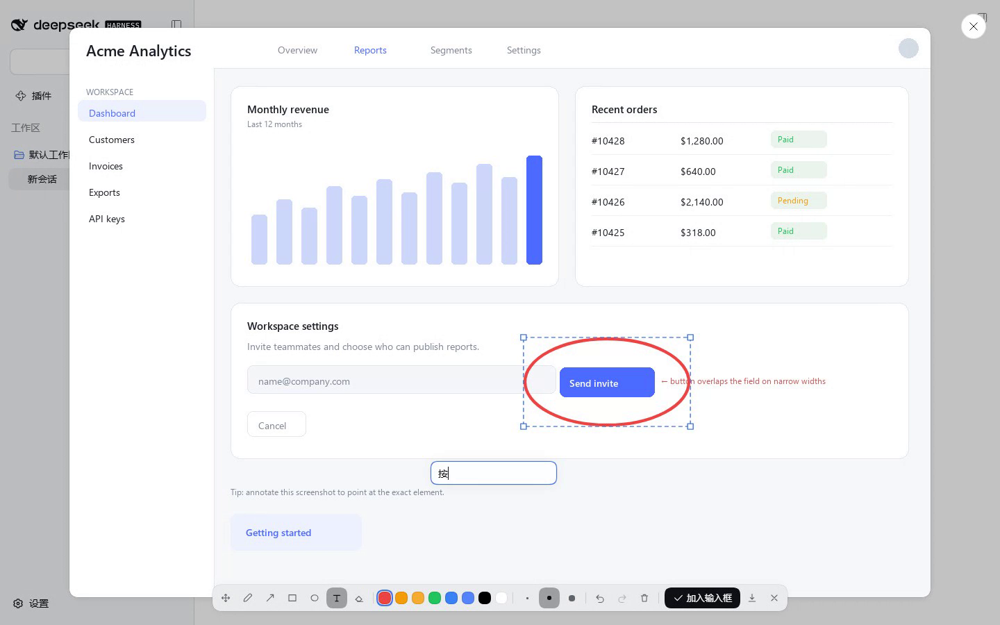

<div align="center">

# dsh-image-annotate

**An annotation pen for the DeepSeek Harness image lightbox.**
Circle it, label it, move it around — then drop the annotated PNG straight into the composer.

[](https://github.com/topics/dsh-plugin)
[](https://github.com/zhishengplus/dsh-image-annotate)
[](./LICENSE)

English | [简体中文](README.zh_CN.md)

</div>


*Click an image → **Annotate** → circle it, type a label, drag both into place → **Add to composer**.*



Click any image in DSH → a round **Annotate** button appears in the bottom-right of the preview
(same shape as the native close button) → draw circles / arrows / boxes / text — **every mark stays
editable afterwards** → **Add to composer** puts the flattened PNG into your input box, so the next
message you send carries the annotated picture. No server, no upload, no build step.

## Why it exists

Screenshots are how you explain a UI problem — "this button", "that spacing", "here it overlaps".
Typing coordinates is hopeless, so this plugin copies the Claude-style annotation flow into DSH:
mark the image, then type your sentence normally. The model receives the marked-up image.

## Features

| | |
|---|---|
| **Seven tools** | Move · Pen · Arrow · Box · Circle · Text · Eraser |
| **Palette** | 8 colors taken from the native DSH color tokens (including brand `deepseek-450`), 3 widths |
| **Edit after drawing** | click any mark to select it, drag to move, drag a corner handle to scale, `Delete` to remove, arrow keys to nudge 1px (`Shift` 10px) |
| **Text is a real object** | double-click to re-edit the words (same mark, no duplicate); the Text tool can drag a placed label directly |
| **Undo / redo** | every draw / move / scale / edit / delete is one history step (`Ctrl+Z`, `Ctrl+Shift+Z`) |
| **Send to model** | **Add to composer** flattens image + marks at the **original resolution** and attaches it to the composer; falls back to drop → clipboard → download if the composer cannot take it |
| **Native look** | the whole UI is built on DSH design tokens (menu surface, elevation, radii, toast, focus ring) |
| **Zero dependencies** | no `@deepseek-ai/*` imports, no dsh services, no bundler — one hand-written `lib/client.js` |


*The circle was dragged to a new spot, and the label "这里有问题" was moved after it was typed —
selection box and corner handles use the native accent blue.*

### Keyboard (inside annotation mode)

`V` move · `1`–`7` tools · `E` eraser · `Ctrl/⌘+Z` undo · `Ctrl/⌘+Shift+Z` redo ·
`Delete` remove selection · arrow keys nudge. Text: click → type → `Enter` (`Esc` cancels).

## Install

```sh
# from GitHub (works right now)
dsh plugin --profile <PROFILE> add github:zhishengplus/dsh-image-annotate

# from npm, once published under your scope
dsh plugin --profile <PROFILE> add @<scope>/dsh-image-annotate

# from a local checkout (development)
dsh plugin --profile <PROFILE> add link:/path/to/dsh-image-annotate
```

Then make sure the bundle is listed in the profile's `package.json`:

```jsonc
"dsh": { "profile": { "bundles": [ /* …, */ "<the package name you installed>" ] } }
```

and **restart DSH once** — profile bundles are composed at boot. After that, edits to
`lib/client.js` are picked up by client-modules HMR (keyed on mtime); a page refresh is enough.

Uninstall: remove the folder from the profile's `node_modules` and drop the line from
`dsh.profile.bundles`.

## How it works

* **Everything is stored in original-image pixels.** Marks keep natural-image coordinates, so the
  overlay, the drag math and the export stay consistent: a 1909×1231 screenshot shown at 1427×920
  exports as a 1909×1231 PNG with the marks exactly where you put them.
* **It augments, never replaces.** The plugin watches for the body-portalled preview
  (`div[role="dialog"][aria-modal="true"] > img`), overlays one canvas plus a toolbar, and removes
  everything when the preview closes. No slot registration, no React tree surgery.
* **Delivery reuses the composer's own intake.** Flatten → `File` → a synthetic `paste` event at the
  Lexical input (`[data-composer-input]`) — exactly the path a pasted screenshot takes. If that is
  refused, it retries as a document-level `drop`, then copies to the clipboard, then downloads.
* **Export can't be tainted.** The original is re-fetched as a blob and decoded before compositing,
  which avoids `toBlob` SecurityErrors on cross-origin previews.

## Development

```sh
npm run check          # syntax check both halves
npm test               # fixture suites (needs Python + Playwright): 17 + 19 checks
npm run test:e2e       # end-to-end in a real, isolated DSH instance (see below)
npm run pack:dry       # inspect the npm tarball contents
```

The fixture suites open `test/lightbox-fixture.html` — a fake lightbox with the exact DOM shape DSH
uses — and assert drawing, undo, selection, dragging, resizing, text editing and export at pixel
level. `test/e2e_dsh.py` drives a disposable DSH instance (a copy of your profile, on another port)
through the full flow: open preview → annotate → move → attach → assert the composer rail gained a
`1909×1231` attachment.

```sh
python -m playwright install chromium
python test/test_annotate.py
python test/test_edit.py
```

## Debug

```js
__dshImageAnnotate.annotators[0].state     // tool / strokes / selected / natural / rect …
localStorage.setItem('@dsh-plugin/dsh-image-annotate.debug', '1')   // verbose logs
```

## Known limitations

* Only the **original-image lightbox** gets the pen. Images opened from the right-hand file browser
  use a different document-preview component and have no entry point yet.
* The first install needs a DSH restart (bundle composition happens at boot).
* Marks only exist in the newly composed PNG; the original file is never modified.

## License

[MIT](LICENSE)
